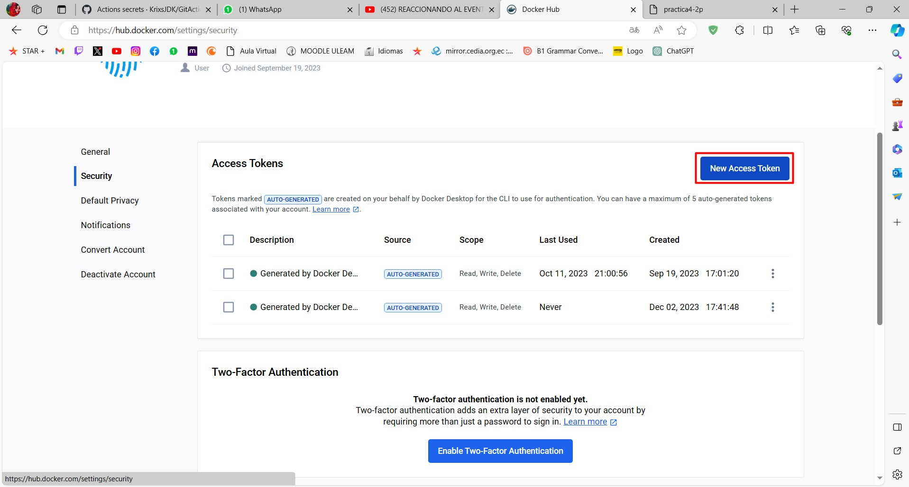
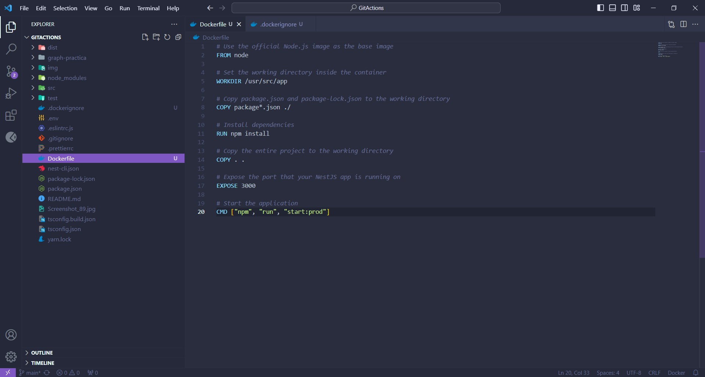
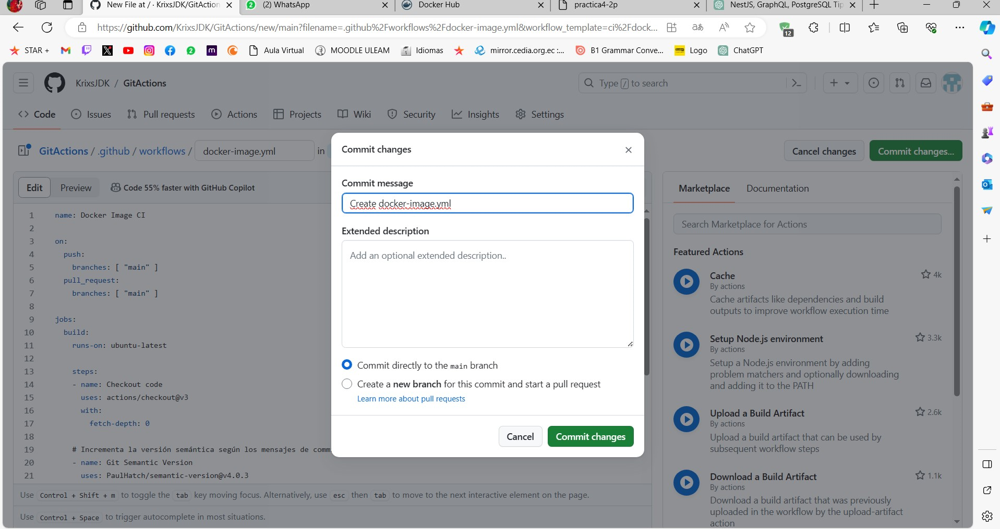

| Antony Palacios | Gustavo Rodriguez | Cristhopher Alcivar | Diego Flores | Ian Velez | Isaac Joviric |
| ------ | ------ | ------ | ------ |  ------ | ------ |
|

|

|

|

|

|

|

# Dockerización de Aplicación NestJS y GitHub Actions

## Descripción
Este repositorio demuestra cómo Dockerizar una aplicación NestJS y configurar un flujo de trabajo en GitHub Actions para construir y desplegar contenedores de Docker.

## Pasos por seguir

### 1. Crear Repositorio

Crea un repositorio público o privado en GitHub. [Enlace al Repositorio](https://github.com/KrixsJDK/GitActions.git)

### 2. Preparar el Código Fuente

Luego solo realizamos el commit del código a utilizar

### 4. Configurar Secrets en GitHub

Crea los secrets DOCKER_USER y DOCKER_PASSWORD en la sección de Secrets de tu repositorio en GitHub.

### 5. Configurar Token de Docker Hub

Utiliza tu usuario y clave (token) de Docker Hub para llenar los secrets DOCKER_USER y DOCKER_PASSWORD.
Crea un Token en Docker (con el nombre Github-Actions) y copia este Token generado en el secret DOCKER_PASSWORD.

#### 6. Dockerizar la Aplicación

Dockeriza tu aplicación NestJS (preferiblemente un servicio REST o GraphQL sin dependencias).

#### 7. Verificar Construcción y Funcionamiento

Asegúrate de que la imagen puede ser compilada con el siguiente comando:
bash
docker login
docker build -t byotony/webhooks:latest .
Verifica el funcionamiento de la aplicación.

Tambien hacemos el push

Y ya para terminar hacemos el commit para que se hagan los builds automáticamente cuando realizemos un commit nuevo al repositorio.

### 8. Crear Action Docker Image
Configura un flujo de trabajo en GitHub Actions para generar la imagen Docker utilizando el archivo docker-image.yml.

# Evidencias

Ya tenemos el actions creado para realizar builds automáticos.

Ahora lo progamos realizando un commit nuevo a nuestro repositorio

Y cuando lo guardamos, se estará gerenando un build nuevo automáticamente.

Proceso de build.

Build terminado, proceso sin errores. 
