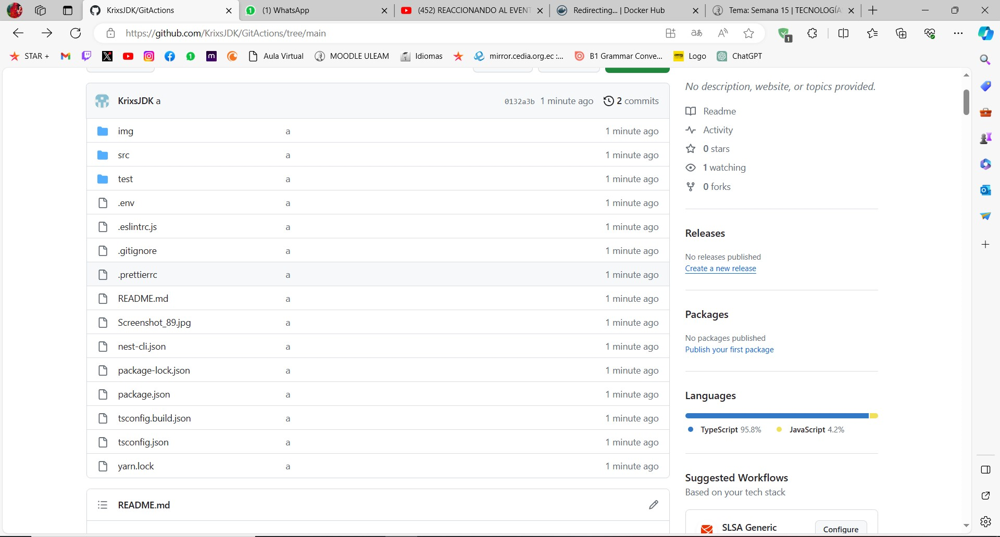
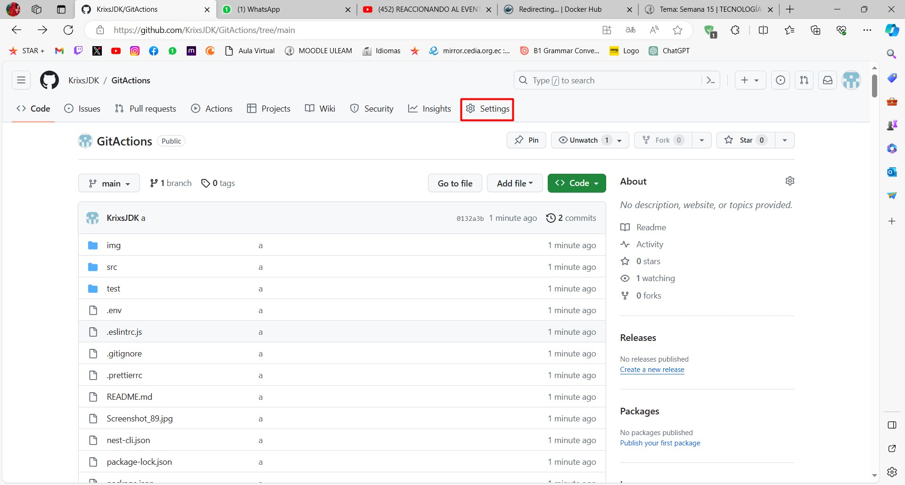
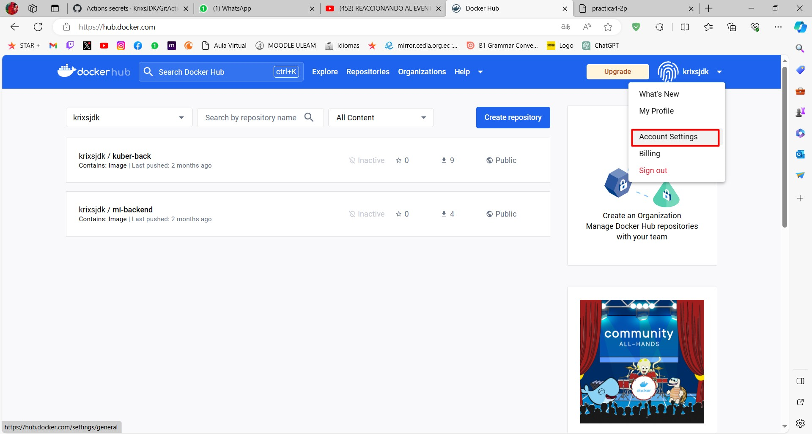
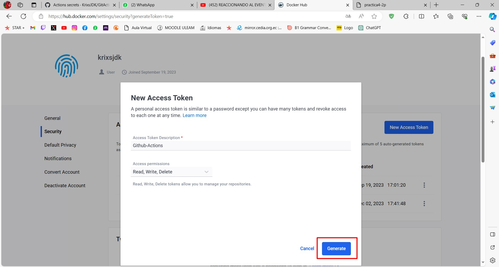
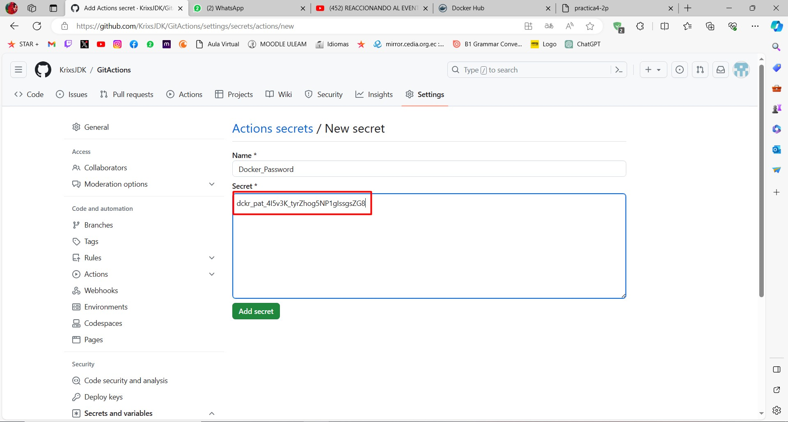
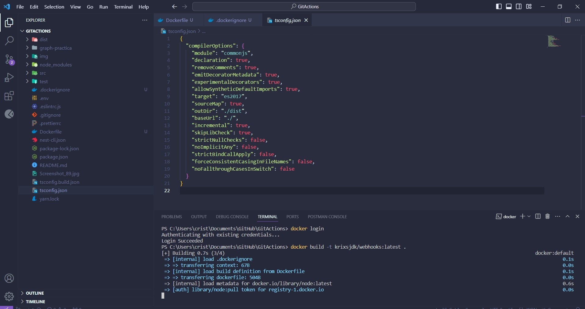
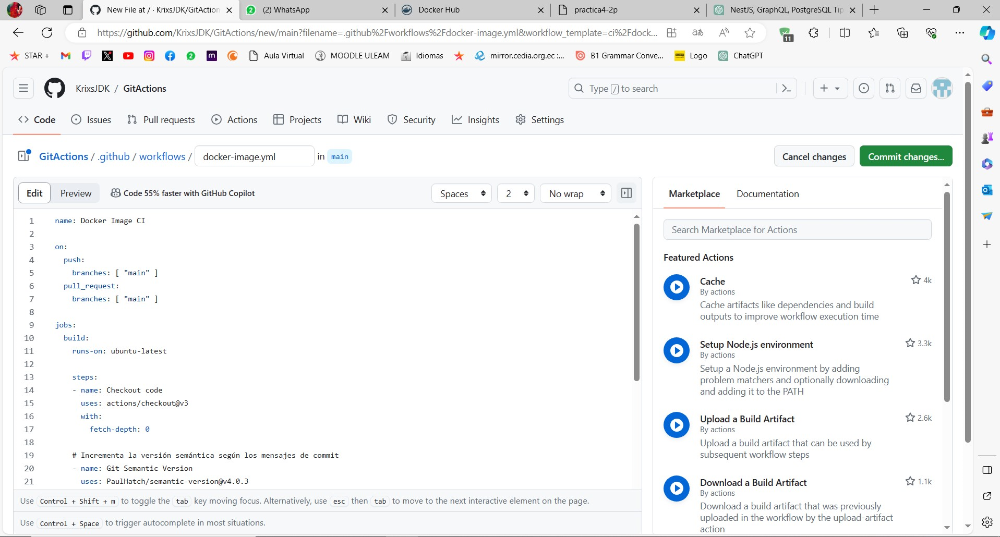
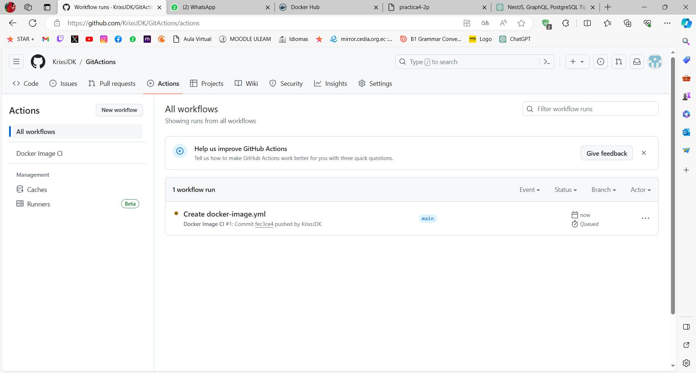

| Antony Palacios | Gustavo Rodriguez | Cristhopher Alcivar | Diego Flores | Ian Velez | Isaac Joviric |
| ------ | ------ | ------ | ------ |  ------ | ------ |
|

|

|

|

|

|

|

# GraphQL

## Pasos de la clases
Lo primero con nuestra parte del proyecto grupal selecionaremos nuestra seccion correspondiente, en este caso historial, 
en la cual nos guiaremos con la estrctura hecha de ejemplo, adapatada a nuestra seccion quedaria de la siguiente manera:

### En la carpeta DTO aplicada a nuestra seccion quedaria de esta manera
### create_historial_m

### index 

### update-historial_m

### En la carpeta entities aplicada a nuestra seccion quedaria de esta manera
### historial_m.entity

### En la carpeta historial en los archivos generados por graphql aplicaremos la estructura correspondiente
### historial_m.module
Quedaria de la siguiente manera:

### historial_m.resolver
Quedaria de la siguiente manera:

### historial_m.service
Quedaria de la siguiente manera:

### por ultimo nos conectamos con la base de Datos en Postgres
La cual cpn nuestro datos quedaria asi:

## Pasos Adicionales.
Agregar una clase (entidad) adicional y un atributo que permita relacionar (Uno a Muchos) su entidad con la nueva. Adicionalmente compruebe en la consulta que el objeto vinculado es cargado de forma sistemática. (Este punto solo debe ser desarrollado y evidenciado si no logra culminar la actividad en clases)

### Para esto creamos la relacion enfermedades a historial.

### En la carpeta DTO aplicada a nuestra seccion quedaria de esta manera
### create_enfermedad

### update-enfermedad

### En la carpeta entities aplicada a nuestra seccion quedaria de esta manera
### enfermedad.entity

### En la carpeta enfermedades en los archivos generados por graphql aplicaremos la estructura correspondiente
### enfermedad.module
Quedaria de la siguiente manera:

### enfermedad.resolver
Quedaria de la siguiente manera:

### enfermedad.service
Quedaria de la siguiente manera:

## Prueba de Funcionamiento Completo.

### Creacion de Mutuacion

### Creacion de Query

### Cambio de Estado
#### Primero selecionamos el id que deseamos cambiar con remove

#### Despues vemos el cambio exitoso con el query
